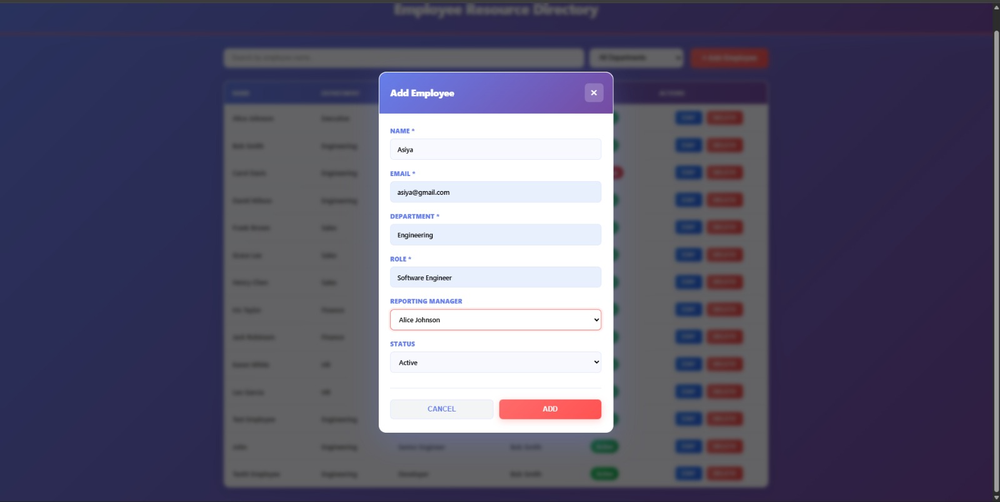
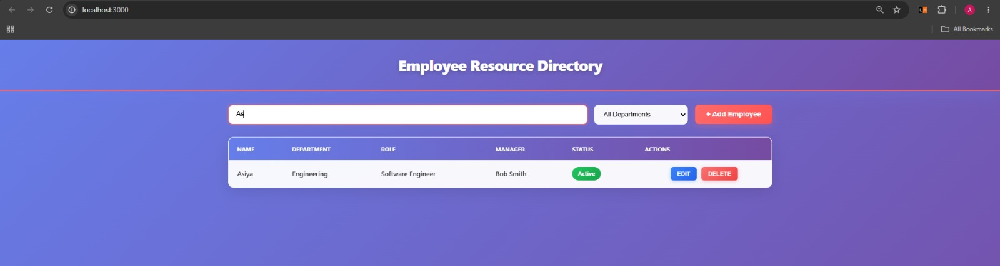
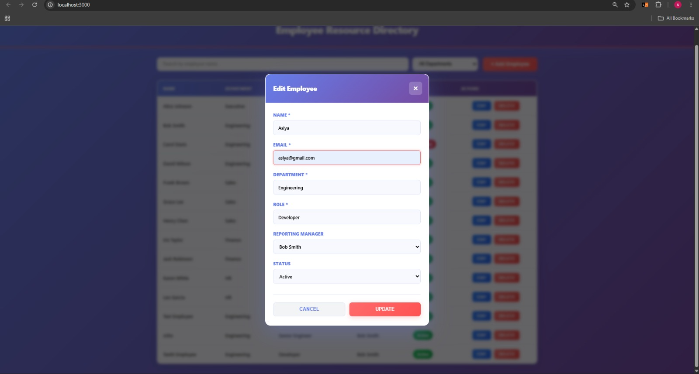
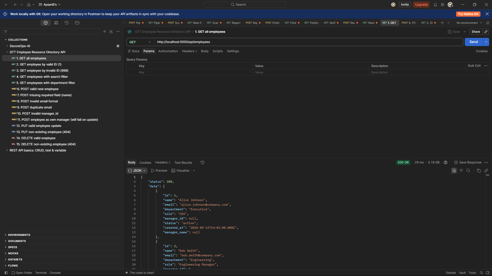
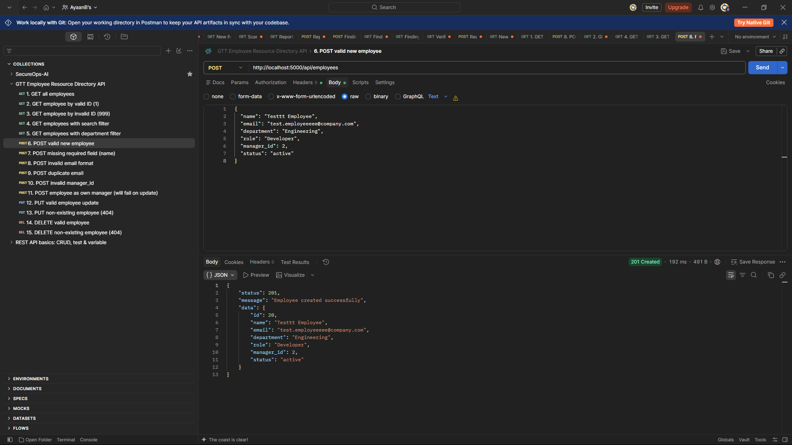

# Employee Resource Directory

## Overview

Employee Resource Directory is a full-stack web application for managing employee information. It provides a clean, professional interface to view, search, filter, add, edit, and delete employee records with features like reporting manager assignment, department filtering, and real-time validation.

## Tech Stack

- **Frontend**: React JS 18.2
- **Backend**: Node.js + Express 4.18
- **Database**: MySQL 3.6.5
- **API Communication**: Axios
- **Build Tool**: React Scripts 5.0

## Screenshots

### Dashboard


### Search & Filter


### Add Employee


### Update Employee


### Postman - GET Request


### Postman - POST Request


## Features

- ✓ **Employee Listing** - View all employees in a responsive table
- ✓ **Search** - Filter employees by name in real-time
- ✓ **Department Filtering** - Filter by department, combinable with search
- ✓ **Add Employee** - Create new employee records with modal form
- ✓ **Edit Employee** - Update existing employee information
- ✓ **Delete Employee** - Remove employee records with confirmation
- ✓ **Reporting Manager** - Assign and view manager relationships with self-assignment prevention
- ✓ **Status Management** - Set employee status (active/inactive)
- ✓ **Client-Side Validation** - Required fields, email format validation
- ✓ **Server-Side Validation** - Email uniqueness, manager existence, business logic validation
- ✓ **Loading States** - User feedback during data fetching
- ✓ **Error Handling** - User-friendly error messages with retry capability
- ✓ **Empty States** - Clear messaging when no data is available
- ✓ **Automated Testing** - 1 backend + 1 frontend test (both passing)

## Project Structure

```
employee-resource-directory/
├── frontend/                    # React application
│   ├── public/
│   │   └── index.html
│   ├── src/
│   │   ├── components/
│   │   │   ├── SearchBar.jsx
│   │   │   ├── EmployeeTable.jsx
│   │   │   ├── EmployeeForm.jsx
│   │   │   └── styles/
│   │   │       ├── SearchBar.css
│   │   │       ├── EmployeeTable.css
│   │   │       └── EmployeeForm.css
│   │   ├── services/
│   │   │   └── employeeApi.js    # API service layer
│   │   ├── App.js                # Main component with state
│   │   ├── App.css
│   │   ├── index.js
│   │   └── setupTests.js
│   ├── package.json
│   └── README.md
│
├── backend/                     # Node.js/Express API
│   ├── src/
│   │   ├── config/
│   │   │   └── db.js            # MySQL connection pool
│   │   ├── controllers/
│   │   │   └── employeeController.js  # Business logic
│   │   ├── routes/
│   │   │   └── employeeRoutes.js      # API endpoints
│   │   ├── middleware/
│   │   │   └── errorHandler.js        # Centralized error handling
│   │   ├── app.js               # Express app setup
│   │   └── server.js            # Server entry point
│   ├── .env                     # Environment variables (not committed)
│   ├── .env.example             # Template for .env
│   ├── .gitignore
│   ├── package.json
│   └── README.md
│
├── database/
│   ├── schema.sql               # Database schema with seed data
│   └── README.md
│
├── docs/
│   ├── PHASE-1.md               # Project setup documentation
│   ├── PHASE-2.md               # Backend API documentation
│   ├── PHASE-3.md               # Frontend implementation
│   ├── PHASE-4.md               # Integration & edge cases
│   └── postman/
│       └── GTT_Employee_Resource_Directory_API.postman_collection.json
│
├── .gitignore
└── README.md
```

## Prerequisites

Before you begin, ensure you have the following installed:

- **Node.js** v18.0.0 or higher (download from [nodejs.org](https://nodejs.org))
- **npm** v9.0.0 or higher (comes with Node.js)
- **MySQL** v5.7 or higher (download from [mysql.com](https://www.mysql.com))

Verify installation:
```bash
node --version
npm --version
mysql --version
```

## Database Setup

### 1. Create Database and Run Schema

Start MySQL and run the schema file:

```bash
# Login to MySQL
mysql -u root -p

# In MySQL shell, run:
source database/schema.sql;

# Verify database was created
SHOW DATABASES;
USE employee_directory;
SHOW TABLES;
SELECT COUNT(*) FROM employees;  # Should show 12 seed records
```

Or use a single command (if using MySQL CLI):
```bash
mysql -u root -p employee_directory < database/schema.sql
```

### 2. Seed Data

The schema.sql includes 12 seed employees across multiple departments:
- **Departments**: Executive, Engineering, Sales, Finance, HR
- **Relationships**: Manager-employee reporting lines
- **Status**: Mix of active and inactive employees

Example records:
- Alice Johnson (CEO, no manager)
- Bob Smith (Engineering Manager, reports to Alice)
- Carol Davis (Senior Engineer, reports to Bob)

## Environment Variables

### Backend (.env file)

Create a `backend/.env` file with the following structure:

```env
# Database Configuration
DB_HOST=localhost
DB_USER=root
DB_PASSWORD=your_mysql_password
DB_NAME=employee_directory
DB_PORT=3306

# Server Configuration
PORT=5000
NODE_ENV=development
```

**Important**: Never commit `.env` files. Use `.env.example` as a template.

Example `.env.example`:
```env
# Database Configuration
DB_HOST=localhost
DB_USER=root
DB_PASSWORD=your_password_here
DB_NAME=employee_directory
DB_PORT=3306

# Server Configuration
PORT=5000
NODE_ENV=development
```

## Backend Setup

### 1. Install Dependencies

```bash
cd backend
npm install
```

### 2. Configure Environment Variables

```bash
# Copy the example file
cp .env.example .env

# Edit .env with your MySQL credentials
# Update DB_PASSWORD to match your MySQL password
```

### 3. Verify Database Connection

```bash
npm start
```

You should see:
```
✓ Database connected successfully
✓ Employee Directory API running on http://localhost:5000
✓ Endpoints: http://localhost:5000/api/employees
```

Press `Ctrl+C` to stop the server.

### 4. Development Mode (Optional)

For development with auto-restart on file changes:
```bash
npm run dev
```

Requires `nodemon` (already in devDependencies).

## Frontend Setup

### 1. Install Dependencies

```bash
cd frontend
npm install
```

### 2. Start Development Server

```bash
npm start
```

The application will automatically open in your browser at `http://localhost:3000`.

If it doesn't open automatically, navigate to: `http://localhost:3000`

## Running the Application

### Start Backend First

```bash
cd backend
npm start
```

Expected output:
```
✓ Database connected successfully
✓ Employee Directory API running on http://localhost:5000
```

The backend must be running before starting the frontend.

### Start Frontend (in a new terminal)

```bash
cd frontend
npm start
```

The React development server will start and open the application in your browser.

### Access the Application

- **Frontend**: http://localhost:3000
- **Backend API**: http://localhost:5000/api/employees

## API Endpoints

All endpoints return JSON responses with `status` codes and data or error messages.

### 1. GET /api/employees

Retrieve all employees with optional filtering.

**Query Parameters:**
- `search` (optional): Filter by employee name (case-insensitive substring match)
- `department` (optional): Filter by exact department name

**Example Requests:**
```bash
# Get all employees
GET http://localhost:5000/api/employees

# Search by name
GET http://localhost:5000/api/employees?search=Alice

# Filter by department
GET http://localhost:5000/api/employees?department=Engineering

# Combine search and filter
GET http://localhost:5000/api/employees?search=Bob&department=Engineering
```

**Response (200 OK):**
```json
{
  "status": 200,
  "data": [
    {
      "id": 1,
      "name": "Alice Johnson",
      "email": "alice.johnson@company.com",
      "department": "Executive",
      "role": "CEO",
      "manager_id": null,
      "manager_name": null,
      "status": "active",
      "created_at": "2024-01-01T00:00:00.000Z"
    },
    ...
  ]
}
```

### 2. GET /api/employees/:id

Retrieve a specific employee by ID.

**Example Request:**
```bash
GET http://localhost:5000/api/employees/1
```

**Response (200 OK):**
```json
{
  "status": 200,
  "data": {
    "id": 1,
    "name": "Alice Johnson",
    "email": "alice.johnson@company.com",
    "department": "Executive",
    "role": "CEO",
    "manager_id": null,
    "manager_name": null,
    "status": "active",
    "created_at": "2024-01-01T00:00:00.000Z"
  }
}
```

**Response (404 Not Found):**
```json
{
  "status": 404,
  "error": "Employee with ID 999 not found"
}
```

### 3. POST /api/employees

Create a new employee.

**Request Body:**
```json
{
  "name": "Jane Doe",
  "email": "jane.doe@company.com",
  "department": "Engineering",
  "role": "Senior Engineer",
  "manager_id": 2,
  "status": "active"
}
```

**Example Request:**
```bash
curl -X POST http://localhost:5000/api/employees \
  -H "Content-Type: application/json" \
  -d '{
    "name": "Jane Doe",
    "email": "jane.doe@company.com",
    "department": "Engineering",
    "role": "Senior Engineer",
    "manager_id": 2,
    "status": "active"
  }'
```

**Response (201 Created):**
```json
{
  "status": 201,
  "message": "Employee created successfully",
  "data": {
    "id": 13,
    "name": "Jane Doe",
    "email": "jane.doe@company.com",
    "department": "Engineering",
    "role": "Senior Engineer",
    "manager_id": 2,
    "status": "active"
  }
}
```

**Response (400 Bad Request):**
```json
{
  "status": 400,
  "error": "Email already exists"
}
```

### 4. PUT /api/employees/:id

Update an existing employee.

**Request Body** (any or all fields):
```json
{
  "name": "Jane Smith",
  "role": "Lead Engineer",
  "status": "inactive"
}
```

**Example Request:**
```bash
curl -X PUT http://localhost:5000/api/employees/13 \
  -H "Content-Type: application/json" \
  -d '{
    "name": "Jane Smith",
    "role": "Lead Engineer"
  }'
```

**Response (200 OK):**
```json
{
  "status": 200,
  "message": "Employee updated successfully"
}
```

**Response (404 Not Found):**
```json
{
  "status": 404,
  "error": "Employee with ID 999 not found"
}
```

### 5. DELETE /api/employees/:id

Delete an employee by ID.

**Example Request:**
```bash
curl -X DELETE http://localhost:5000/api/employees/13
```

**Response (200 OK):**
```json
{
  "status": 200,
  "message": "Employee deleted successfully"
}
```

**Response (404 Not Found):**
```json
{
  "status": 404,
  "error": "Employee with ID 999 not found"
}
```

## Validation Rules

### Required Fields

All required fields must be non-empty strings:
- **Name**: Text, 1-100 characters
- **Email**: Valid email format (see below)
- **Department**: Text, 1-50 characters
- **Role**: Text, 1-50 characters

### Email Validation

- Must be in valid email format: `user@domain.com`
- Must be unique across all employees (database constraint)
- Case-insensitive for uniqueness checks

### Manager Validation

- `manager_id` is optional (employee can have no manager)
- If provided, the manager must exist in the system
- An employee **cannot** be their own manager (prevents circular references)
- During edit: current employee is excluded from manager dropdown

### Status Validation

- Valid values: `"active"` or `"inactive"`
- Defaults to `"active"` if not provided
- Case-sensitive

### Server-Side Validation

All validation occurs on the server. The backend returns `400 Bad Request` with descriptive error messages:
- "Name is required"
- "Invalid email format"
- "Email already exists"
- "Department is required"
- "Role is required"
- "Invalid manager_id - manager does not exist"
- "Employee cannot be their own manager"
- "Status must be 'active' or 'inactive'"

## Assumptions

1. **MySQL is running locally** on `localhost:3306` with root access configured
2. **Node.js development environment** with npm package manager available
3. **Port availability**: Ports 3000 (React), 5000 (Express API), 3306 (MySQL) are available
4. **Modern browser**: Frontend tested on recent versions of Chrome, Firefox, Safari, Edge
5. **CORS enabled**: Backend allows requests from `http://localhost:3000`
6. **Database schema exists**: `schema.sql` has been run before starting the application
7. **No authentication required**: Application assumes single-user or trusted environment
8. **UTF-8 encoding**: All database connections use UTF-8 for string data
9. **Cascading deletes**: Deleting an employee sets their reports' `manager_id` to NULL
10. **Email uniqueness**: Database enforces unique email constraint

## Known Limitations

1. **No Authentication**: Application does not implement user authentication or authorization
2. **No Role-Based Access**: All users have full CRUD permissions
3. **No Audit Trail**: No history of who made what changes or when
4. **No Pagination**: All employees are loaded in a single request (suitable for <1000 records)
5. **No File Uploads**: Employee photos/documents are not supported
6. **No Bulk Operations**: Must add/edit/delete employees one at a time
7. **No Email Notifications**: Creating/editing employees doesn't send notifications
8. **No Export Functionality**: Cannot export employee data to CSV/PDF
9. **Limited Reporting**: No advanced employee analytics or reporting
10. **Single Database**: No support for multiple databases or replication

## Future Improvements

Potential enhancements for future versions:

- **Authentication & Authorization**: User login, role-based access control
- **Advanced Search**: Full-text search, filter by date range, salary range
- **Employee Hierarchy**: Visual org chart, team management
- **Bulk Operations**: Import/export CSV, bulk edit, batch operations
- **Media Management**: Employee photos, document uploads
- **Notifications**: Email alerts, activity logging, audit trail
- **Analytics Dashboard**: Employee statistics, department reports, trends
- **Performance Management**: Reviews, ratings, goals tracking
- **Pagination/Virtualization**: Efficient rendering of large employee lists
- **Mobile App**: Native iOS/Android applications
- **Calendar Integration**: Schedule management, time-off tracking
- **API Documentation**: Auto-generated API docs (Swagger/OpenAPI)

## Testing

### Running Tests

**Backend Tests:**
```bash
cd backend
npm test
```

Expected output:
```
PASS  src/__tests__/employees.test.js
  Employee API - POST /api/employees
    √ should reject POST request with missing required field (name)

Test Suites: 1 passed, 1 total
Tests:       1 passed, 1 total
```

**Frontend Tests:**
```bash
cd frontend
npm test
```

Expected output:
```
PASS src/components/EmployeeForm.test.js
  EmployeeForm Component
    √ should display validation error when form is submitted empty

Test Suites: 1 passed, 1 total
Tests:       1 passed, 1 total
```

### Test Coverage

**Backend** (`backend/src/__tests__/employees.test.js`):
- Tests POST /api/employees endpoint
- Validates that missing required field (name) returns 400 error
- Ensures validation works correctly

**Frontend** (`frontend/src/components/EmployeeForm.test.js`):
- Tests EmployeeForm component
- Validates that submitting empty form shows "Name is required" error
- Ensures client-side validation works correctly

## Troubleshooting

### Backend won't start

```bash
# Check if port 5000 is in use
lsof -i :5000  # macOS/Linux
netstat -ano | findstr :5000  # Windows

# Kill the process using port 5000 or change PORT in .env
```

### Database connection fails

```bash
# Verify MySQL is running
mysql -u root -p -e "SELECT 1"

# Check .env credentials match your MySQL setup
# Verify database exists
mysql -u root -p -e "SHOW DATABASES; USE employee_directory; SHOW TABLES;"
```

### Frontend can't reach backend

```bash
# Ensure backend is running on port 5000
curl http://localhost:5000/api/employees

# Check proxy setting in frontend/package.json
# Should be: "proxy": "http://localhost:5000"

# If using a different backend URL, update frontend/src/services/employeeApi.js
# Change: const API_BASE_URL = 'http://localhost:5000/api';
```

### Port already in use

```bash
# macOS/Linux: Find and kill process
lsof -i :3000  # Find process on port 3000
kill -9 <PID>

# Windows: Find and kill process
netstat -ano | findstr :3000
taskkill /PID <PID> /F
```

## Additional Resources

- [React Documentation](https://react.dev)
- [Express.js Guide](https://expressjs.com)
- [MySQL Reference](https://dev.mysql.com/doc)
- [Axios Documentation](https://axios-http.com)
- [Project Problem Statement](./intern_problem_statement.md)

## License

ISC License

## Support

For issues, questions, or contributions, please refer to the documentation in `/docs` directory and review the phase-based documentation files (PHASE-1 through PHASE-6).
